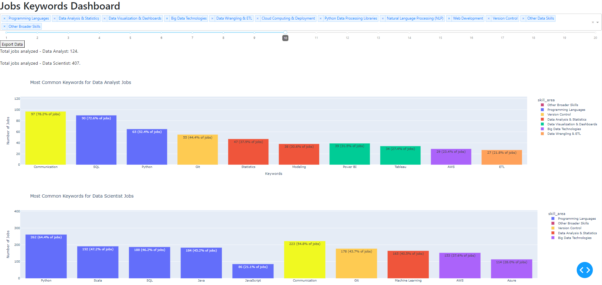
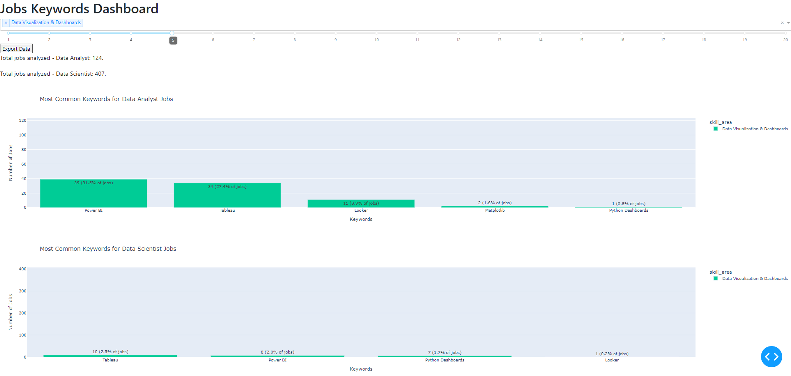
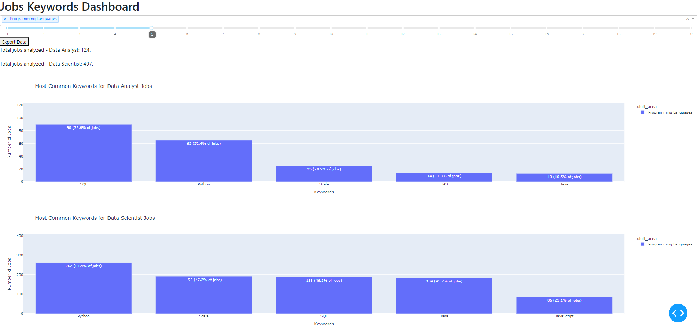
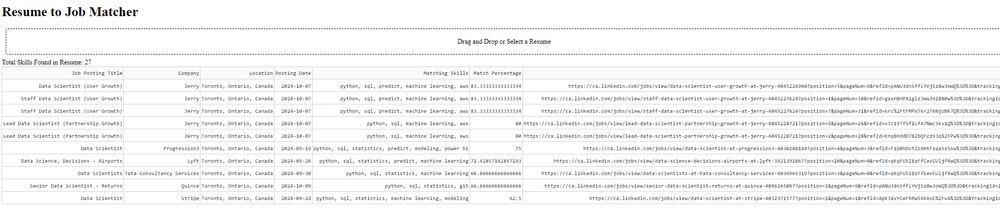

# Resume Matcher and Top Skills for Data Scientists and Analysts

## Project Overview and Summary
This repository contains a collection of scripts and tools designed to analyze job postings for Data Scientists and Data Analysts. It includes functionalities for scraping job data, extracting skills and salaries, performing sentiment analysis, and creating interactive dashboards to visualize top skills and match resumes to job descriptions.


## Findings

***Job Skills Dashboard***


The job skills dashboard above highlights that **Python**, **SQL**, and **Communication** skills are among the top five skills for both data scientists and data analysts. If you're considering upskilling, these areas are a great place to start.


***Job Skills Dashboard filtered by Visualisation Tools***


When filtering by visualization tools, it’s clear that these tools are much more prevalent in data analyst roles, which is expected, but it's interesting to have a quantitative measure of this. Among the various tools mentioned, **Power BI** and **Tableau** are mentioned the most and also are in a comparable number of job descriptions. However, Power BI has a slight edge, appearing in 31.5% of job listings compared to Tableau's 27.4%. 

If you're considering which visualization tool to upskill in, Power BI is the recommended choice, given its higher prevalence in job descriptions.


***Job Skills Dashboard filtered by Progrmamming Languages***


When examining the programming skills required for data analyst and data scientist positions, **SQL** stands out as the most essential language for data analysts, appearing in 72.6% of job descriptions. This indicates a strong demand for database querying and data manipulation skills. In contrast, **Python** is the top programming language for data scientists, mentioned in 64.4% of listings, reflecting its versatility in data analysis and machine learning applications. 


***Resume Matcher***


The Resume Matcher Dashboard can be seen below and looks like I have all the skills mentioned for more than one job!

## Folder Structure
The project is organized into the following scripts:
1. **LinkedIn_Jobs_Scraping_Dog_API**: Scrapes job postings from LinkedIn using the Scraping Dog API.
2. **Custom_Web_Scrape_Linkedin_Data_Jobs**: Custom web scraping solution for LinkedIn job data.
3. **Skill_Salary_Sentiment-Extractor**: Extracts skills and salary information while performing sentiment analysis on job descriptions.
4. **Dash_Top_Skills_Data_Scientist_vs_Data_Analyst**: Creates a dashboard to visualize top skills required for Data Scientists and Data Analysts.
5. **Dash_Resume_Job_Matcher**: Matches resumes with job descriptions based on extracted skills.
6. Appendix 1. **Data_Scientist_Analyst_Job_Keywords**: This contains all data analysta and data scientist skills and can be updated.

Additionally, all generated CSV and JSON files are included, allowing users to run scripts 4 and 5 without executing the previous steps.

## Installation Instructions
1. Clone the repository and navigate to the project directory by running the following commands in your terminal:
   ```bash
   git clone https://github.com/kmfisher480/Resume_Matcher_and_Top_Skills_For_Data_Scientists_and_Analysts.git
   cd Resume_Matcher_and_Top_Skills_For_Data_Scientists_and_Analysts
   ```

## Usage

To run the applications, execute the following commands:

1. **To see the top skills required for Data Scientists vs. Data Analysts:**
   ```bash
   python 4_Dash_Top_Skills_Data_Scientist_vs_Data_Analyst.py
   ```

2. **To upload a resume and see the jobs you best match:**
   ```bash
   python 5_Dash_Resume_Job_Matcher.py
   ```

3. **You can run these Dash apps without rerunning steps 1-3, but if you want to customize the location or jobs, please follow the steps below:**

   a. **Starting with the first script: `1_LinkedIn_Jobs_Scraping_Dog_API`:**
   
   - Create an account with Scraping Dog:
     [Sign up here](https://www.scrapingdog.com/?deal=scraper&gad_source=1&gclid=CjwKCAjw68K4BhAuEiwAylp3ksCUGkqeqmbNfm6ErMOrvZj6zb5_pmV-nJUtgAszrbwV-5Rhbj_L7RoCF5kQAvD_BwE).
     
   - Fill in your API key in the following block:
     ```python
     url = "https://api.scrapingdog.com/linkedinjobs/"
     api_key = "xxxxx"  # Enter your API key from Scraping Dog when you sign up; they give you a 30-day free trial!
     field = "Data Scientist"  # Replace with "Data Analyst" or any other job title!
     geoid = "100025096"  # This is Toronto; you can find this by looking at the URL of a specific job posting on LinkedIn in your desired location.
     sort_by = "month"  # Looks at jobs posted in the last month.
     ```

   - Fill in the geoid you want, they can be found by looking at the geoId in the url if you go to LinkedIn and search for a job, see below example:
     https://www.linkedin.com/jobs/search/?currentJobId=4050591559&geoId=100025096&keywords=data%20analyst&origin=JOB_SEARCH_PAGE_SEARCH_BUTTON&refresh=true

   - Run this script and you will generate a json file of the job title and links to job descriptions

   b. **The Second Script: `2_Custom_Web_Scrape_Linkedin_Data_Jobs`:**
   
      - Enter your linkedIn Log in details and the path to your chrome_driver in the below section:
     ```python
     # Set up Selenium WebDriver
     chromedriver_path = r'C:\Users\xxxxx\chromedriver-win64\chromedriver-win64\chromedriver.exe' #enter path to your chromer driver - should look something like this but replace xxxxx
     service = Service(chromedriver_path)
     chrome_options = Options()
     driver = webdriver.Chrome(service=service, options=chrome_options)
     os.environ['LINKEDIN_EMAIL'] = 'xxxxx' #enter your email log in for linkedin
     os.environ['LINKEDIN_PASSWORD'] = 'xxxxx!' #enter your pass word for linked
     ```
      - This copies job description, experience level, contract type, remote vs hybrid, number of applicants from the url. You may need to check that the xpath has not changed. Use chrome developer tools to inspect this.

   c. **The Third Script: `3_Skill_Salary_Sentiment-Extractor`:**
   
      - This extract all skills, salary (if exsists), sentiment analysis, positive buzzwords and puts them in dataframe in wide format. If the skill is listed in the job desrription there will be a 1 under this skill for this job.

## Requirements
Summary of Libraries
1. **Data Manipulation**: pandas, numpy, csv, json
2. **Web Scraping**: requests, beautifulsoup4, selenium
3. **Data Visualization**: matplotlib, seaborn, plotly, dash, dash_bootstrap_components
4. **Machine Learning**: transformers
5. **File Management**: os, tempfile
6. **Others**: PyPDF2, logging, time, random

You can install the required libraries using pip:
```bash
pip install pandas numpy beautifulsoup4 requests plotly dash Flask
```

## Contributing
Contributions are welcome! If you have suggestions for improvements or new features, feel free to open an issue or submit a pull request.

## License
This project is licensed under the MIT License - see the [LICENSE](LICENSE) file for details.
